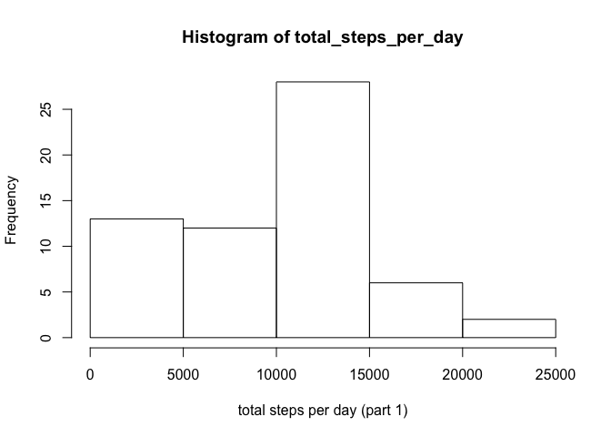
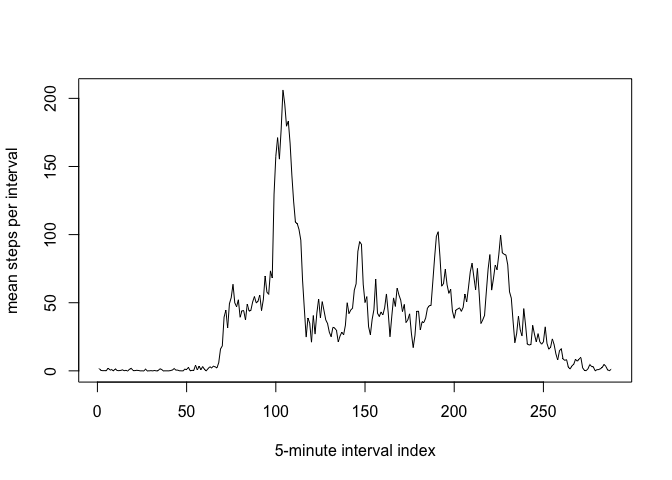
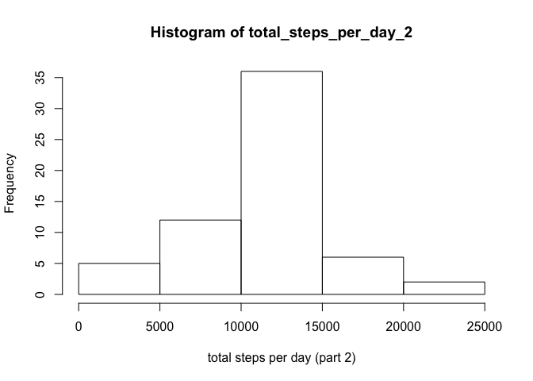
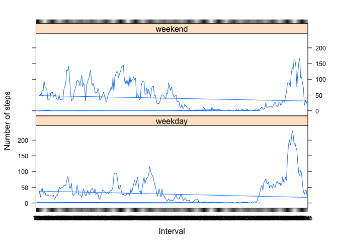

# Reproducible Research: Peer Assessment 1


## Loading and preprocessing the data

```r
activity_data <- read.csv('./activity.csv')
#activity_data$date = strptime(activity_data$date, "%Y-%m-%d")  # donj't do this!
#str(activity_data)
```

## What is mean total number of steps taken per day?

```r
total_steps_per_day <- tapply(activity_data$steps, activity_data$date, sum, na.rm = TRUE)
hist(total_steps_per_day, xlab = "total steps per day (part 1)")
```

<!-- -->

```r
mean_total_steps_per_day <- mean(total_steps_per_day)
median_total_steps_per_day <- median(total_steps_per_day)
```
* Mean total steps per day: 9354.2295082
* Median total steps per day: 10395

## What is the average daily activity pattern?


```r
mean_steps_per_interval <- tapply(activity_data$steps, activity_data$interval, mean, na.rm = TRUE)
plot(mean_steps_per_interval, type = "l", xlab = "5-minute interval index", ylab = "mean steps per interval")
```

<!-- -->

```r
max_mean_interval_idx <- which.max(mean_steps_per_interval)
max_mean_interval_name <- names(mean_steps_per_interval)[max_mean_interval_idx]
```
* Which 5-minute interval, on average across all the days in the dataset, contains the maximum number of steps? 835 (index 104)

## Imputing missing values

```r
total_number_of_missing_values <- sum(!complete.cases(activity_data))
complete_activity_data <- data.frame(activity_data)
missing_idx <- rownames(complete_activity_data[!complete.cases(complete_activity_data), ])
interval_mean_df <- data.frame(interval=as.integer(names(mean_steps_per_interval)), mean_steps=mean_steps_per_interval)
for (i in 1:dim(complete_activity_data)[1]) {
  if (is.na(complete_activity_data[i, "steps"])) {
    complete_activity_data[i, "steps"] = interval_mean_df[interval_mean_df$interval == complete_activity_data[i, "interval"], "mean_steps"]
  }
}

total_steps_per_day_2 <- tapply(complete_activity_data$steps, complete_activity_data$date, sum, na.rm = TRUE)
hist(total_steps_per_day_2, xlab = "total steps per day (part 2)")
```

<!-- -->

```r
mean_total_steps_per_day_2 <- mean(total_steps_per_day_2)
median_total_steps_per_day_2 <- median(total_steps_per_day_2)
```
* the total number of missing values in the dataset: 2304
* Mean total steps per day (part 2): 1.0766189\times 10^{4}
* Median total steps per day (part 2): 1.0766189\times 10^{4}
* Do these values differ from the estimates from the first part of the assignment? yes
* What is the impact of imputing missing data on the estimates of the total daily number of steps?
  Imputing missing data increases both the mean and median and makes the histogram more likely to be of normal distribution, compared to the original dataset.

## Are there differences in activity patterns between weekdays and weekends?

```r
library(lattice)
a <- weekdays(strptime(complete_activity_data$date, "%Y-%m-%d"))
complete_activity_data$weekday <- as.factor(ifelse((a == "Saturday") | (a == "Sunday"), "weekend", "weekday"))
weekday_data <- complete_activity_data[complete_activity_data$weekday == "weekday",]
weekend_data <- complete_activity_data[complete_activity_data$weekday == "weekend",]
mean_weekday_steps_per_interval <- tapply(weekday_data$steps, weekday_data$interval, mean, na.rm = TRUE)
mean_weekend_steps_per_interval <- tapply(weekend_data$steps, weekend_data$interval, mean, na.rm = TRUE)
week_data <- rbind(data.frame(interval = names(mean_weekday_steps_per_interval), steps = mean_weekday_steps_per_interval, weekday = "weekday"), data.frame(interval = names(mean_weekend_steps_per_interval), steps = mean_weekend_steps_per_interval, weekday = "weekend"))
xyplot(week_data$steps ~ week_data$interval | week_data$weekday, layout = c(1,2), xlab = "Interval", ylab = "Number of steps", type = "l")
```

<!-- -->

